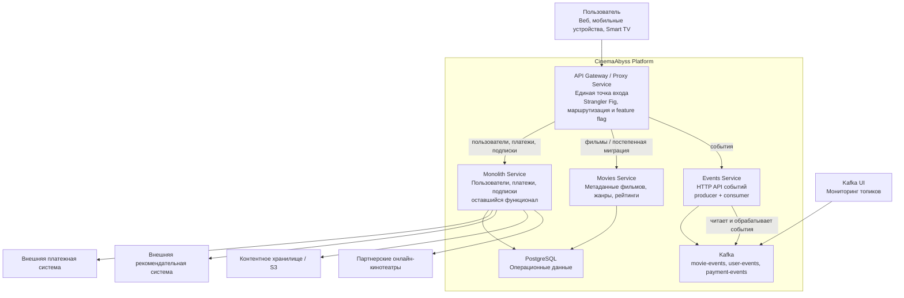

# To-Be архитектура CinemaAbyss

Этот документ описывает целевую контейнерную архитектуру `CinemaAbyss` для
второго спринта. За основу взята текущая `as-is` схема из
`кинобезднаasis.drawio`, но целевое состояние уже учитывает выделенные
микросервисы, `API Gateway`, событийное взаимодействие через `Kafka` и
развертывание в `Kubernetes`.

## Контейнерная диаграмма C4

## Контейнеры и ответственность

| Контейнер | Назначение |
|---|---|
| `API Gateway / Proxy Service` | Единая точка входа для клиентов. Применяет паттерн `Strangler Fig`, маршрутизирует вызовы между монолитом и новыми сервисами, поддерживает поэтапную миграцию трафика на `Movies Service`. |
| `Monolith Service` | Сохраняет функциональность пользователей, платежей и подписок. На переходном этапе продолжает обслуживать часть бизнес-потока, пока домены не вынесены полностью. |
| `Movies Service` | Выделенный сервис домена фильмов: список фильмов, метаданные, жанры, рейтинги. Именно на него переключается трафик через feature flag и процент миграции. |
| `Events Service` | Принимает события через HTTP API, публикует их в `Kafka`, затем читает и обрабатывает в рамках MVP-сценария второго спринта. |
| `PostgreSQL` | Основное хранилище прикладных данных. Используется монолитом и сервисом фильмов. |
| `Kafka` | Транспорт событийного взаимодействия между сервисами и источник данных для проверки MVP событийного сервиса. |
| `Kafka UI` | Наблюдаемость за состоянием топиков и сообщениями во время демонстрации решения. |

## Ключевые архитектурные решения

1. Все клиентские запросы идут через `Proxy Service`, а не напрямую в монолит или микросервисы.
2. Выделение домена фильмов выполняется без остановки системы через `Strangler Fig`.
3. Событийное взаимодействие выносится в `Kafka`, а `Events Service` выступает входной точкой для генерации и обработки событий.
4. `PostgreSQL` остаётся общей операционной базой на этапе спринта, что упрощает миграцию и локальную демонстрацию.
5. Развертывание строится с прицелом на `Docker Compose`, затем `Kubernetes`, затем `Helm` и `Istio`.

## Что изменилось относительно as-is

- Вместо одного основного сервиса появляется единая точка входа `API Gateway`.
- Домен фильмов выносится в отдельный контейнер `Movies Service`.
- Вместо `RabbitMQ` целевая событийная шина для спринта — `Kafka`.
- Слой событий выделяется в отдельный `Events Service`.
- Архитектура сразу проектируется с прицелом на контейнеризацию и Kubernetes.
